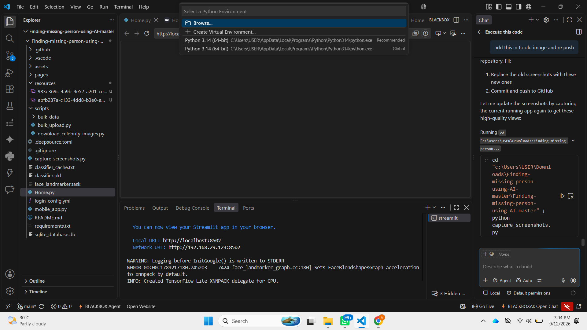

# Missing Person Identification System

 


> [ Endorse on LinkedIn](https://www.linkedin.com/in/gaganmanku96/) if this project was helpful.

---

> **Project Status:** ✅ **VERIFIED & WORKING** 
> 
> This project has been tested and verified to work with:
> - Python 3.14
> - Streamlit 1.63.0
> - MediaPipe Face Landmarker
> - SQLModel + SQLite Database
>
> **Live at:** http://localhost:8501

---

> **Disclaimer**
>
> All images of individuals appearing in the screenshots and used as sample data in this project were sourced from the internet solely for the purpose of demonstrating the facial recognition pipeline in a non-commercial, educational context. These images are the property of their respective owners. No claim of ownership is made. If you are the rights holder of any image and wish it to be removed, please open an issue and it will be taken down promptly.
>
> This project does not store, distribute, or commercialise any personal images. The face data derived from sample images (landmark vectors) is used only locally for matching demonstration and is not shared with any third party.

---

## Table of Contents

- [Quick Start](#quick-start)
- [The Problem](#the-problem)
- [A Case, Start to Finish](#a-case-start-to-finish)
- [How It Works](#how-it-works)
- [Features](#features)
- [Getting Started](#getting-started)
- [Configuring Login Credentials](#configuring-login-credentials)
- [Seeding Demo Data](#seeding-demo-data)
- [Tech Stack](#tech-stack)
- [FAQ](#faq)

---

## Quick Start

### ⚡ Get Running in 3 Steps

```bash
# 1. Install dependencies
pip install -r requirements.txt

# 2. Navigate to project folder
cd Finding-missing-person-using-AI-master

# 3. Run the application
streamlit run Home.py
```

**Then open:** http://localhost:8501

**Login with:**
- Username: `gagan`
- Password: `abc`

---

## The Problem

Hundreds of people — mostly children — go missing every day in India. When a sighting is reported, officers have to manually compare photos, sift through paperwork, and coordinate across stations. By the time a match is confirmed, the trail has often gone cold.

---

## A Case, Start to Finish

**Step 1 — Family files a report. Officer registers the case.**

A family in Haridwar reports their child missing. An officer opens the portal, uploads a photo, and the AI immediately detects the face and extracts a 468-point mesh — no manual tagging needed.

)

---

**Step 2 — The dashboard tracks every open case.**

The officer's home screen shows live counts of found and not-found cases, and a map that plots where cases are concentrated across India.


---

**Step 3 — A member of the public submits a sighting.**

Someone recognises the person and submits a photo through the public portal (no login required). The same face mesh is extracted and stored.

When an admin clicks **All Cases**, they can view submitted cases, search, filter, and manage case records. Edit or delete cases as needed.


---

**Step 3 — Matching & Analytics**

Admins can trigger the **Match Cases** function to run the KNN algorithm, comparing all sightings against registered missing persons. When matches are found, cases are automatically updated and notifications are sent.

The **Map** page displays case distribution by city across India, helping prioritize investigation resources.



---

## How It Works

1. **Officer registers a case** → uploads a photo → AI extracts a 468-point face mesh
2. **Public submits a sighting** → uploads a photo or video → same extraction
3. **Admin clicks Refresh** → KNN matches faces across both datasets → email sent to complainant on match

No manual photo comparison. No paperwork pile-up.

---

## Features

| Feature | Details |
|---|---|
| Face detection | MediaPipe Face Landmarker — highlights detected faces, handles multiple people in frame |
| AI matching | KNN on 1,404-dimensional face vectors; shows confidence % |
| Video sightings | Upload a video — unique faces extracted automatically per frame |
| Live map | Dashboard map showing case density by city across India |
| Email alerts | Auto-notifies complainant email when a match is confirmed |
| Role-based access | Admins can match, edit, delete; Officers can register and view |
| Public portal | Separate mobile-friendly submission page, no login needed |

---

## Getting Started

```bash
git clone https://github.com/gaganmanku96/Finding-missing-person-using-AI.git
cd Finding-missing-person-using-AI
pip install -r requirements.txt
```

Run the officer/admin portal:
```bash
streamlit run Home.py
```

Run the public submission portal:
```bash
streamlit run mobile_app.py
```

The SQLite database and face landmarker model (~30 MB, auto-downloaded on first use) are created automatically.

### Optional: Email notifications

Set these environment variables to enable email alerts on match:
```
SMTP_HOST, SMTP_PORT, SMTP_USER, SMTP_PASSWORD
```
The complainant's email entered during case registration is used as the recipient.

---

## Configuring Login Credentials

Credentials are stored in `login_config.yml`. To add or change a user:

**1. Generate a bcrypt password hash:**
```python
import bcrypt
print(bcrypt.hashpw(b"your_password", bcrypt.gensalt()).decode())
```

**2. Edit `login_config.yml`:**
```yaml
credentials:
  usernames:
    your_username:               # used as the login username
      name: Your Display Name
      email: you@example.com
      city: Delhi
      area: Sector 1
      role: Admin                # Admin or Officer
      password: '$2b$12$...'     # paste the hash from step 1
```

**Roles:**
| Role | Permissions |
|---|---|
| Admin | Register cases, view all cases, trigger matching, edit/delete cases |
| Officer | Register cases, view own cases |

> `login_config.yml` is git-ignored by default. Never commit real credentials.

---

## Seeding Demo Data

The `scripts/` folder contains two utilities for populating the database with demo data.

### Step 1 — Download sample images

```bash
# Download ~2 images per celebrity into scripts/bulk_data/reported/
uv run scripts/download_celebrity_images.py --dest reported

# Or split across both folders (reported + publicly_seen)
uv run scripts/download_celebrity_images.py --dest both
```

This uses DuckDuckGo image search — no API key needed.

You can also drop your own images directly into:
```
scripts/bulk_data/reported/        ← missing person cases
scripts/bulk_data/publicly_seen/   ← public sighting submissions
```

### Step 2 — Run the bulk upload

```bash
python scripts/bulk_upload.py
```

This processes every image in both folders:
- Extracts a face mesh using MediaPipe (images with no detectable face are skipped)
- Generates realistic metadata (names, cities, Aadhaar numbers, last-seen locations)
- Inserts records into the SQLite database
- Copies images to `resources/` so the app can display them

By default `submitted_by` is set to `gagan` (the username in the default `login_config.yml`). If you've changed your username, pass it explicitly:

```bash
python scripts/bulk_upload.py --officer your_username
```

To reset and re-seed from scratch:
```bash
sqlite3 sqlite_database.db "DELETE FROM registeredcases; DELETE FROM publicsubmissions;"
python scripts/bulk_upload.py
```

---

## Tech Stack

- **Streamlit** — UI for both portals
- **MediaPipe Tasks** — face mesh landmark extraction (468 points × 3D)
- **scikit-learn KNN** — face matching
- **SQLModel + SQLite** — data storage
- **Folium** — interactive map
- **OpenCV** — video frame extraction

---

## FAQ

**Q: Can I run this without an internet connection?**
The face landmarker model (~30 MB) is downloaded once on first run and cached locally. After that, both portals work fully offline.

**Q: How accurate is the face matching?**
Accuracy depends heavily on photo quality. Front-facing, well-lit photos work best. The confidence score shown on each match reflects KNN distance — higher is a stronger match.

**Q: Can I add multiple officers?**
Yes. Add as many usernames as needed to `login_config.yml`. Each officer sees only their own registered cases; Admins see all cases.

**Q: The map doesn't show a city I entered.**
The map uses a built-in city → coordinates lookup. If a city is missing, open an issue or add it to the `CITY_COORDS` dict in `Home.py`.

**Q: Where is the data stored?**
Everything is in `sqlite_database.db` (git-ignored) in the project root. Images are stored as JPGs in `resources/` (also git-ignored). Nothing is sent to any external server.

**Q: How do I reset the database?**
```bash
sqlite3 sqlite_database.db "DELETE FROM registeredcases; DELETE FROM publicsubmissions;"
```
Or simply delete `sqlite_database.db` — it will be recreated on next run.

**Q: Can the public portal be hosted separately from the officer portal?**
Yes. They are independent Streamlit apps (`Home.py` and `mobile_app.py`) and share only the SQLite database. Point both to the same database file path and they will work together.

---

*Thanks to the [MediaPipe](https://mediapipe.dev/) team for the open-source face landmarker model.*
